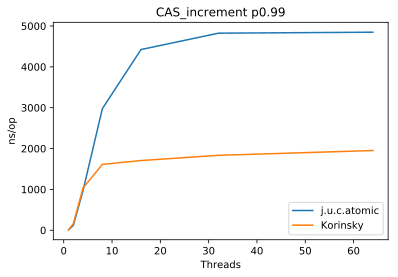

# Korinsky's Atomic 

It is the low-latency atomic operations for a multi-threads environment for JVM.

It has similar API with `java.util.concurrent.atomic` but it much faster at the multi-threads environment,
 you can just update imports and enjoy it.

Each time when CAS loop can't update the value, it disables current thread for a very smaller possible time
 to prevent stupid looping when another thread may release the value.

## How to use it?

It is in Maven Central, and can be added to a Maven project as follows

```
        <dependency>
            <groupId>ky.korins</groupId>
            <artifactId>atomic</artifactId>
            <version>1.1</version>
        </dependency>
```


## How fast is it?

It is similar with `j.u.c.atomic` for one concurrent thread and has 2x times lower latency for bigger concurrency.



Full benchmark:

| Benchmark    | Threads | p0.00 | p0.50 | p0.90 | p0.95 | p0.99 | p0.999 | p0.9999 | p1.00   |
|--------------|---------|-------|-------|-------|-------|-------|--------|---------|---------|
| J.u.c.atomic | 1       | 8     | 8     | 8     | 8     | 9     | 18     | 138     | 479     |
| Korinsky     | 1       | 8     | 8     | 8     | 8     | 9     | 18     | 135     | 560     |
| J.u.c.atomic | 2       | 8     | 74    | 108   | 113   | 123   | 206    | 234     | 1716    |
| Korinsky     | 2       | 8     | 14    | 64    | 92    | 164   | 300    | 536     | 2068    |
| J.u.c.atomic | 4       | 9     | 188   | 579   | 721   | 973   | 1292   | 1476    | 20576   |
| Korinsky     | 4       | 9     | 137   | 340   | 490   | 1036  | 2368   | 4136    | 10384   |
| J.u.c.atomic | 8       | 9     | 550   | 868   | 1294  | 2976  | 5472   | 8095    | 131840  |
| Korinsky     | 8       | 9     | 402   | 919   | 1140  | 1612  | 2168   | 2596    | 130432  |
| J.u.c.atomic | 16      | 9     | 767   | 921   | 1224  | 4424  | 130816 | 220672  | 1161216 |
| Korinsky     | 16      | 9     | 772   | 1170  | 1334  | 1706  | 130816 | 220672  | 1290240 |
| J.u.c.atomic | 32      | 9     | 773   | 924   | 1202  | 4824  | 330752 | 893952  | 3313664 |
| Korinsky     | 32      | 9     | 782   | 1190  | 1360  | 1834  | 330240 | 840704  | 2838528 |
| J.u.c.atomic | 64      | 9     | 772   | 926   | 1146  | 4848  | 700416 | 1812480 | 7282688 |
| Korinsky     | 64      | 9     | 785   | 1204  | 1384  | 1952  | 660480 | 1730560 | 6684672 |

Measured at `Intel(R) Xeon(R) CPU E5-1650 v3 @ 3.50GHz` at
```
openjdk version "9.0.1"
OpenJDK Runtime Environment (build 9.0.1+11-Debian-1)
OpenJDK 64-Bit Server VM (build 9.0.1+11-Debian-1, mixed mode)
```

## Which operations does it support?

Right now it supports `AtomicLong`, `AtomicInteger`, `AtomicBoolean`, `AtomicLongArray` and `AtomicIntegerArray`
 with Java8 compatibility API.

## Why does `j.u.c.atomic` increment is faster without concurrent threads?

This atomic implemented all operation includes `getAndAdd*` and `addAndGet*` over CAS-loop,
 `j.u.c.atomic`'s `getAndAdd` and `addAndGet*` uses `lock addq` CPU instruction
 or just `i++` where `i` is `volatile` variable that much faster without concurrent threads.

## Why does it add unspecified backoff timeout?

JVM hasn't got a way to make very small specified sleep period. It has few different ways to add a sleep period:
 - `Thread.onSpinWait()` since Java9
 - `Thread.yield()`
 - `Thread.sleep(long millis)` or `Thread.sleep(long millis, int nanos)`
 - `Object.wait(long timeout, int nanos)` or `Object.wait(long timeout, int nanos)`
 - `LockSupport.parkNanos(long nanos)`
 - `TimeUnit.sleep(x)`

If we check the code we will see that:
 - `Object.wait(0, 1)` is `Object.wait(1)`
 - `Thread.sleep(0, 1)` is `Thread.sleep(0)` or `Thread.sleep(1)` that depends on amount of nanos
 - `TimeUnit.sleep(X)` is `Thread.sleep(ms, ns)`

And if we made a simple test we will have results:

on my laptop with macOS I have
```
Benchmark                     Mode  Cnt        Score      Error  Units
LockSupport.parkNanos(1)      avgt   20    10553.701 ±  309.104  ns/op
LockSupport.parkNanos(10)     avgt   20    13006.281 ±   73.393  ns/op
LockSupport.parkNanos(100)    avgt   20    12976.135 ±  139.048  ns/op
LockSupport.parkNanos(1000)   avgt   20     5795.405 ±  132.921  ns/op
LockSupport.parkNanos(10000)  avgt   20     6127.251 ±  203.732  ns/op
Object.wait(0, 1)             avgt   20  1351918.387 ± 7285.491  ns/op
Thread.onSpinWait()           avgt   20        3.271 ±    0.047  ns/op
Thread.sleep(0)               avgt   20      258.652 ±    3.411  ns/op
Thread.yield()                avgt   20      225.066 ±    3.808  ns/op
```

on debian sid I have
```
Benchmark                     Mode  Cnt        Score      Error  Units
LockSupport.parkNanos(1)      avgt   20      288.112 ±    1.606  ns/op
LockSupport.parkNanos(10)     avgt   20      285.572 ±    0.784  ns/op
LockSupport.parkNanos(100)    avgt   20     4674.412 ±  237.567  ns/op
LockSupport.parkNanos(1000)   avgt   20    55064.592 ±  245.676  ns/op
LockSupport.parkNanos(10000)  avgt   20    54860.746 ±  593.290  ns/op
Object.wait(0, 1)             avgt   20  1120201.743 ± 2152.094  ns/op
Thread.onSpinWait()           avgt   20        2.496 ±    0.003  ns/op
Thread.sleep(0)               avgt   20      183.340 ±    2.365  ns/op
Thread.yield()                avgt   20      170.595 ±    2.303  ns/op
```

JVM hasn't got any way to make a small specified timeout and:
 - `Object.wait(0, 1)` is about 1 ms
 - `LockSupport.parkNanos(long nanos)` is absolutely unpredictable
 - `Thread.sleep(0)` and `Thread.yield()` very close (~13%) but depends on platform
 - `Thread.onSpinWait()` is faster but depends on platform and works only since Java9

`Thread.onSpinWait()` is converted to `pause` CPU instruction if the target system supports it (by CPU and by JVM),
 and to nothing, when it doesn’t..

Honestly, we don't need just `pause`, the idea of this low-latency atomic operation is doesn't burn CPU cycles
 for CAS-loop when another threads may finish same CAS-loop.

Anyway, this code is using `LockSupport.parkNanos(1)` because tests've shown that it is the best option.

Very short summary (only p0.9999):


Full data:

| Benchmark                                    | Threads | p0.00 | p0.50 | p0.90 | p0.95 | p0.99  | p0.999  | p0.9999 | p1.00   |
|----------------------------------------------|---------|-------|-------|-------|-------|--------|---------|---------|---------|
| LockSupport.parkNanos(1)                     | 1       | 8     | 8     | 8     | 8     | 9      | 18      | 135     | 560     |
| LockSupport.parkNanos(10)                    | 1       | 8     | 8     | 8     | 8     | 9      | 18      | 137     | 533     |
| LockSupport.parkNanos(100)                   | 1       | 8     | 8     | 8     | 8     | 9      | 18      | 140     | 458     |
| LockSupport.parkNanos(1000)                  | 1       | 8     | 8     | 8     | 8     | 9      | 18      | 137     | 1560    |
| LockSupport.parkNanos(10000)                 | 1       | 8     | 8     | 8     | 8     | 9      | 18      | 136     | 473     |
| LockSupport.parkNanos(25)                    | 1       | 8     | 8     | 8     | 8     | 9      | 18      | 139     | 460     |
| LockSupport.parkNanos(250)                   | 1       | 8     | 8     | 8     | 8     | 9      | 18      | 130     | 1542    |
| LockSupport.parkNanos(2500)                  | 1       | 8     | 8     | 8     | 8     | 9      | 18      | 138     | 422     |
| LockSupport.parkNanos(5)                     | 1       | 8     | 8     | 8     | 8     | 9      | 18      | 132     | 1394    |
| LockSupport.parkNanos(50)                    | 1       | 8     | 8     | 8     | 8     | 9      | 18      | 138     | 462     |
| LockSupport.parkNanos(500)                   | 1       | 8     | 8     | 8     | 8     | 9      | 18      | 124     | 551     |
| LockSupport.parkNanos(5000)                  | 1       | 8     | 8     | 8     | 8     | 9      | 18      | 136     | 536     |
| Plain()                                      | 1       | 8     | 8     | 8     | 8     | 9      | 18      | 138     | 479     |
| Thread.onSpinWait_LockSupport_parkNanos(1)   | 1       | 8     | 8     | 8     | 8     | 9      | 18      | 133     | 1386    |
| Thread.onSpinWait_LockSupport_parkNanos(128) | 1       | 8     | 8     | 8     | 8     | 9      | 18      | 136     | 5624    |
| Thread.onSpinWait_LockSupport_parkNanos(16)  | 1       | 8     | 8     | 8     | 8     | 9      | 18      | 132     | 1390    |
| Thread.onSpinWait_LockSupport_parkNanos(2)   | 1       | 8     | 8     | 8     | 8     | 9      | 18      | 143     | 6544    |
| Thread.onSpinWait_LockSupport_parkNanos(32)  | 1       | 8     | 8     | 8     | 8     | 9      | 18      | 135     | 462     |
| Thread.onSpinWait_LockSupport_parkNanos(4)   | 1       | 8     | 8     | 8     | 8     | 9      | 18      | 133     | 489     |
| Thread.onSpinWait_LockSupport_parkNanos(64)  | 1       | 8     | 8     | 8     | 8     | 9      | 18      | 135     | 327     |
| Thread.onSpinWait_LockSupport_parkNanos(8)   | 1       | 8     | 8     | 8     | 8     | 9      | 18      | 137     | 485     |
| Thread.onSpinWait_yield(1)                   | 1       | 8     | 8     | 8     | 8     | 9      | 18      | 133     | 439     |
| Thread.onSpinWait_yield(128)                 | 1       | 8     | 8     | 8     | 8     | 9      | 18      | 135     | 1544    |
| Thread.onSpinWait_yield(16)                  | 1       | 8     | 8     | 8     | 8     | 9      | 18      | 136     | 670     |
| Thread.onSpinWait_yield(2)                   | 1       | 8     | 8     | 8     | 8     | 9      | 18      | 136     | 489     |
| Thread.onSpinWait_yield(32)                  | 1       | 8     | 8     | 8     | 8     | 9      | 18      | 139     | 6336    |
| Thread.onSpinWait_yield(4)                   | 1       | 8     | 8     | 8     | 8     | 9      | 18      | 138     | 1582    |
| Thread.onSpinWait_yield(64)                  | 1       | 8     | 9     | 9     | 9     | 9      | 115     | 125     | 501     |
| Thread.onSpinWait_yield(8)                   | 1       | 8     | 8     | 8     | 8     | 9      | 18      | 134     | 591     |
| Thread.onSpinWait()                          | 1       | 8     | 8     | 8     | 8     | 9      | 18      | 140     | 497     |
| Thread.sleep(0)                              | 1       | 8     | 8     | 8     | 8     | 9      | 18      | 138     | 477     |
| Thread.sleep(1)                              | 1       | 8     | 8     | 8     | 8     | 9      | 18      | 147     | 490     |
| Thread.yield()                               | 1       | 8     | 8     | 8     | 8     | 9      | 18      | 136     | 410     |
| LockSupport.parkNanos(1)                     | 2       | 8     | 14    | 64    | 92    | 164    | 300     | 536     | 2068    |
| LockSupport.parkNanos(10)                    | 2       | 8     | 15    | 57    | 81    | 141    | 242     | 363     | 3080    |
| LockSupport.parkNanos(100)                   | 2       | 8     | 8     | 9     | 9     | 10     | 6784    | 21472   | 72320   |
| LockSupport.parkNanos(1000)                  | 2       | 8     | 8     | 9     | 9     | 10     | 6896    | 22336   | 78848   |
| LockSupport.parkNanos(10000)                 | 2       | 8     | 8     | 9     | 9     | 10     | 8064    | 26784   | 139264  |
| LockSupport.parkNanos(25)                    | 2       | 8     | 15    | 60    | 83    | 143    | 251     | 374     | 816     |
| LockSupport.parkNanos(250)                   | 2       | 8     | 8     | 9     | 9     | 10     | 5744    | 19840   | 77824   |
| LockSupport.parkNanos(2500)                  | 2       | 8     | 8     | 9     | 9     | 10     | 8168    | 25152   | 107392  |
| LockSupport.parkNanos(5)                     | 2       | 8     | 16    | 61    | 86    | 152    | 320     | 853     | 2620    |
| LockSupport.parkNanos(50)                    | 2       | 8     | 14    | 70    | 107   | 225    | 540     | 939     | 20384   |
| LockSupport.parkNanos(500)                   | 2       | 8     | 8     | 9     | 9     | 10     | 8400    | 25216   | 84352   |
| LockSupport.parkNanos(5000)                  | 2       | 8     | 8     | 9     | 9     | 10     | 7432    | 25056   | 89088   |
| Plain()                                      | 2       | 8     | 74    | 108   | 113   | 123    | 206     | 234     | 1716    |
| Thread.onSpinWait_LockSupport_parkNanos(1)   | 2       | 10    | 15    | 122   | 462   | 2416   | 9408    | 13744   | 42304   |
| Thread.onSpinWait_LockSupport_parkNanos(128) | 2       | 8     | 89    | 114   | 122   | 137    | 216     | 248     | 9968    |
| Thread.onSpinWait_LockSupport_parkNanos(16)  | 2       | 8     | 97    | 129   | 147   | 177    | 236     | 298     | 6744    |
| Thread.onSpinWait_LockSupport_parkNanos(2)   | 2       | 10    | 15    | 169   | 685   | 2420   | 12720   | 25568   | 74880   |
| Thread.onSpinWait_LockSupport_parkNanos(32)  | 2       | 8     | 87    | 113   | 123   | 158    | 214     | 269     | 6360    |
| Thread.onSpinWait_LockSupport_parkNanos(4)   | 2       | 10    | 15    | 139   | 350   | 1242   | 2828    | 5184    | 13280   |
| Thread.onSpinWait_LockSupport_parkNanos(64)  | 2       | 8     | 89    | 116   | 123   | 139    | 220     | 286     | 6488    |
| Thread.onSpinWait_LockSupport_parkNanos(8)   | 2       | 8     | 92    | 146   | 164   | 435    | 1474    | 2820    | 19488   |
| Thread.onSpinWait_yield(1)                   | 2       | 10    | 32    | 141   | 294   | 1374   | 3532    | 6808    | 17600   |
| Thread.onSpinWait_yield(128)                 | 2       | 8     | 91    | 112   | 118   | 132    | 216     | 250     | 6344    |
| Thread.onSpinWait_yield(16)                  | 2       | 8     | 93    | 128   | 146   | 171    | 255     | 567     | 1772    |
| Thread.onSpinWait_yield(2)                   | 2       | 10    | 64    | 111   | 197   | 1284   | 3968    | 6637    | 12656   |
| Thread.onSpinWait_yield(32)                  | 2       | 8     | 90    | 121   | 129   | 144    | 224     | 264     | 7984    |
| Thread.onSpinWait_yield(4)                   | 2       | 10    | 80    | 141   | 217   | 694    | 1492    | 2288    | 5584    |
| Thread.onSpinWait_yield(64)                  | 2       | 8     | 89    | 117   | 125   | 142    | 219     | 261     | 1668    |
| Thread.onSpinWait_yield(8)                   | 2       | 10    | 97    | 152   | 171   | 350    | 822     | 1358    | 3092    |
| Thread.onSpinWait()                          | 2       | 8     | 92    | 115   | 123   | 141    | 219     | 257     | 6472    |
| Thread.sleep(0)                              | 2       | 8     | 24    | 57    | 74    | 127    | 234     | 375     | 1702    |
| Thread.sleep(1)                              | 2       | 8     | 8     | 8     | 8     | 9      | 119     | 118272  | 1107968 |
| Thread.yield()                               | 2       | 8     | 28    | 54    | 65    | 94     | 157     | 212     | 662     |
| LockSupport.parkNanos(1)                     | 4       | 9     | 137   | 340   | 490   | 1036   | 2368    | 4136    | 10384   |
| LockSupport.parkNanos(10)                    | 4       | 9     | 130   | 306   | 400   | 771    | 1470    | 2256    | 6768    |
| LockSupport.parkNanos(100)                   | 4       | 8     | 9     | 9     | 10    | 534    | 7872    | 16240   | 52608   |
| LockSupport.parkNanos(1000)                  | 4       | 8     | 9     | 9     | 10    | 64     | 10624   | 24960   | 190976  |
| LockSupport.parkNanos(10000)                 | 4       | 8     | 9     | 9     | 10    | 11     | 12480   | 28576   | 104448  |
| LockSupport.parkNanos(25)                    | 4       | 9     | 147   | 304   | 393   | 793    | 1532    | 2536    | 9760    |
| LockSupport.parkNanos(250)                   | 4       | 8     | 9     | 9     | 10    | 535    | 8384    | 18304   | 58112   |
| LockSupport.parkNanos(2500)                  | 4       | 8     | 9     | 9     | 10    | 12     | 11456   | 25120   | 73088   |
| LockSupport.parkNanos(5)                     | 4       | 9     | 130   | 290   | 380   | 779    | 1684    | 2747    | 6496    |
| LockSupport.parkNanos(50)                    | 4       | 9     | 133   | 337   | 491   | 960    | 1834    | 3064    | 20384   |
| LockSupport.parkNanos(500)                   | 4       | 8     | 9     | 9     | 10    | 47     | 10528   | 22656   | 69376   |
| LockSupport.parkNanos(5000)                  | 4       | 8     | 9     | 9     | 10    | 12     | 10960   | 24576   | 73088   |
| Plain()                                      | 4       | 9     | 188   | 579   | 721   | 973    | 1292    | 1476    | 20576   |
| Thread.onSpinWait_LockSupport_parkNanos(1)   | 4       | 11    | 117   | 500   | 672   | 1068   | 1658    | 2268    | 5816    |
| Thread.onSpinWait_LockSupport_parkNanos(128) | 4       | 9     | 306   | 593   | 651   | 736    | 841     | 941     | 10208   |
| Thread.onSpinWait_LockSupport_parkNanos(16)  | 4       | 11    | 347   | 614   | 664   | 738    | 815     | 882     | 20544   |
| Thread.onSpinWait_LockSupport_parkNanos(2)   | 4       | 11    | 149   | 602   | 830   | 1278   | 1752    | 2132    | 3544    |
| Thread.onSpinWait_LockSupport_parkNanos(32)  | 4       | 9     | 327   | 613   | 673   | 756    | 840     | 915     | 19776   |
| Thread.onSpinWait_LockSupport_parkNanos(4)   | 4       | 11    | 269   | 568   | 699   | 903    | 1116    | 1298    | 6320    |
| Thread.onSpinWait_LockSupport_parkNanos(64)  | 4       | 11    | 340   | 611   | 679   | 776    | 868     | 942     | 20736   |
| Thread.onSpinWait_LockSupport_parkNanos(8)   | 4       | 11    | 322   | 628   | 718   | 868    | 1050    | 1228    | 12080   |
| Thread.onSpinWait_yield(1)                   | 4       | 11    | 241   | 602   | 755   | 1102   | 1392    | 1602    | 10912   |
| Thread.onSpinWait_yield(128)                 | 4       | 9     | 305   | 565   | 609   | 686    | 793     | 919     | 20640   |
| Thread.onSpinWait_yield(16)                  | 4       | 11    | 323   | 609   | 660   | 764    | 908     | 999     | 7912    |
| Thread.onSpinWait_yield(2)                   | 4       | 11    | 243   | 554   | 697   | 947    | 1182    | 1378    | 11104   |
| Thread.onSpinWait_yield(32)                  | 4       | 11    | 320   | 575   | 633   | 758    | 945     | 1044    | 20640   |
| Thread.onSpinWait_yield(4)                   | 4       | 11    | 298   | 539   | 630   | 821    | 995     | 1148    | 9840    |
| Thread.onSpinWait_yield(64)                  | 4       | 11    | 323   | 567   | 619   | 768    | 932     | 1014    | 10448   |
| Thread.onSpinWait_yield(8)                   | 4       | 11    | 329   | 537   | 601   | 698    | 815     | 933     | 15008   |
| Thread.onSpinWait()                          | 4       | 9     | 235   | 535   | 645   | 1094   | 1332    | 1508    | 20416   |
| Thread.sleep(0)                              | 4       | 9     | 192   | 325   | 372   | 513    | 930     | 1486    | 10512   |
| Thread.sleep(1)                              | 4       | 8     | 8     | 9     | 9     | 9      | 21472   | 161280  | 9093120 |
| Thread.yield()                               | 4       | 9     | 189   | 318   | 370   | 505    | 683     | 839     | 10464   |
| LockSupport.parkNanos(1)                     | 8       | 9     | 402   | 919   | 1140  | 1612   | 2168    | 2596    | 130432  |
| LockSupport.parkNanos(10)                    | 8       | 9     | 433   | 858   | 1034  | 1460   | 2042    | 2512    | 253952  |
| LockSupport.parkNanos(100)                   | 8       | 9     | 9     | 10    | 11    | 2716   | 11040   | 20544   | 310272  |
| LockSupport.parkNanos(1000)                  | 8       | 9     | 9     | 10    | 11    | 2664   | 9056    | 16960   | 193536  |
| LockSupport.parkNanos(10000)                 | 8       | 9     | 9     | 10    | 11    | 2500   | 10064   | 19872   | 58944   |
| LockSupport.parkNanos(25)                    | 8       | 9     | 429   | 843   | 1026  | 1462   | 1968    | 2384    | 130560  |
| LockSupport.parkNanos(250)                   | 8       | 9     | 9     | 10    | 11    | 2628   | 9504    | 17792   | 207616  |
| LockSupport.parkNanos(2500)                  | 8       | 8     | 9     | 10    | 11    | 2220   | 8304    | 15488   | 54144   |
| LockSupport.parkNanos(5)                     | 8       | 9     | 411   | 924   | 1150  | 1602   | 2168    | 2636    | 130304  |
| LockSupport.parkNanos(50)                    | 8       | 9     | 409   | 887   | 1088  | 1538   | 2084    | 2508    | 68480   |
| LockSupport.parkNanos(500)                   | 8       | 8     | 9     | 10    | 11    | 2636   | 9024    | 19424   | 193792  |
| LockSupport.parkNanos(5000)                  | 8       | 8     | 9     | 10    | 11    | 2320   | 8640    | 15984   | 51712   |
| Plain()                                      | 8       | 9     | 550   | 868   | 1294  | 2976   | 5472    | 8095    | 131840  |
| Thread.onSpinWait_LockSupport_parkNanos(1)   | 8       | 11    | 566   | 1082  | 1274  | 1714   | 2216    | 2596    | 80768   |
| Thread.onSpinWait_LockSupport_parkNanos(128) | 8       | 9     | 697   | 1424  | 1714  | 2744   | 3388    | 3772    | 130560  |
| Thread.onSpinWait_LockSupport_parkNanos(16)  | 8       | 9     | 722   | 1330  | 1572  | 2536   | 3148    | 3512    | 132096  |
| Thread.onSpinWait_LockSupport_parkNanos(2)   | 8       | 9     | 664   | 1280  | 1488  | 2008   | 2548    | 2944    | 221184  |
| Thread.onSpinWait_LockSupport_parkNanos(32)  | 8       | 9     | 707   | 1384  | 1680  | 2736   | 3388    | 3812    | 45120   |
| Thread.onSpinWait_LockSupport_parkNanos(4)   | 8       | 9     | 734   | 1166  | 1368  | 2008   | 2540    | 2924    | 121088  |
| Thread.onSpinWait_LockSupport_parkNanos(64)  | 8       | 9     | 727   | 1360  | 1614  | 2752   | 3464    | 3896    | 182784  |
| Thread.onSpinWait_LockSupport_parkNanos(8)   | 8       | 9     | 762   | 1168  | 1358  | 2100   | 2612    | 2936    | 131328  |
| Thread.onSpinWait_yield(1)                   | 8       | 11    | 710   | 1264  | 1456  | 1846   | 2540    | 3188    | 370176  |
| Thread.onSpinWait_yield(128)                 | 8       | 11    | 686   | 1640  | 1930  | 2544   | 3332    | 3856    | 190720  |
| Thread.onSpinWait_yield(16)                  | 8       | 11    | 675   | 1714  | 1954  | 2720   | 3464    | 4224    | 89088   |
| Thread.onSpinWait_yield(2)                   | 8       | 11    | 732   | 1100  | 1282  | 1728   | 2160    | 2592    | 60992   |
| Thread.onSpinWait_yield(32)                  | 8       | 11    | 646   | 1668  | 2018  | 2872   | 3492    | 3864    | 131328  |
| Thread.onSpinWait_yield(4)                   | 8       | 11    | 784   | 1184  | 1362  | 1888   | 2236    | 2612    | 31328   |
| Thread.onSpinWait_yield(64)                  | 8       | 10    | 646   | 1632  | 1874  | 2796   | 3532    | 3920    | 161280  |
| Thread.onSpinWait_yield(8)                   | 8       | 11    | 689   | 1572  | 1780  | 2424   | 2992    | 3400    | 24032   |
| Thread.onSpinWait()                          | 8       | 9     | 477   | 1770  | 2088  | 2820   | 3660    | 5344    | 131328  |
| Thread.sleep(0)                              | 8       | 9     | 519   | 845   | 963   | 1358   | 1760    | 2112    | 50560   |
| Thread.sleep(1)                              | 8       | 8     | 8     | 9     | 9     | 10     | 43328   | 183040  | 1814528 |
| Thread.yield()                               | 8       | 9     | 521   | 946   | 1116  | 1568   | 2010    | 2416    | 41408   |
| LockSupport.parkNanos(1)                     | 16      | 9     | 772   | 1170  | 1334  | 1706   | 130816  | 220672  | 1290240 |
| LockSupport.parkNanos(10)                    | 16      | 8     | 766   | 1170  | 1332  | 1700   | 130816  | 220928  | 1310720 |
| LockSupport.parkNanos(100)                   | 16      | 9     | 9     | 13    | 586   | 5728   | 13584   | 22368   | 270848  |
| LockSupport.parkNanos(1000)                  | 16      | 9     | 9     | 12    | 549   | 6504   | 16992   | 28896   | 232960  |
| LockSupport.parkNanos(10000)                 | 16      | 9     | 9     | 11    | 14    | 6384   | 17696   | 28544   | 310272  |
| LockSupport.parkNanos(25)                    | 16      | 8     | 770   | 1168  | 1330  | 1698   | 130816  | 220672  | 1140736 |
| LockSupport.parkNanos(250)                   | 16      | 9     | 9     | 12    | 122   | 6512   | 17088   | 28928   | 291328  |
| LockSupport.parkNanos(2500)                  | 16      | 9     | 9     | 12    | 16    | 6688   | 17472   | 29600   | 259328  |
| LockSupport.parkNanos(5)                     | 16      | 9     | 768   | 1170  | 1332  | 1700   | 130816  | 220928  | 1249280 |
| LockSupport.parkNanos(50)                    | 16      | 9     | 768   | 1168  | 1328  | 1692   | 130816  | 220672  | 1009664 |
| LockSupport.parkNanos(500)                   | 16      | 9     | 9     | 12    | 543   | 6472   | 17184   | 29792   | 550912  |
| LockSupport.parkNanos(5000)                  | 16      | 9     | 9     | 11    | 15    | 6440   | 16928   | 27712   | 244480  |
| Plain()                                      | 16      | 9     | 767   | 921   | 1224  | 4424   | 130816  | 220672  | 1161216 |
| Thread.onSpinWait_LockSupport_parkNanos(1)   | 16      | 9     | 887   | 1368  | 1604  | 2072   | 131072  | 221440  | 1010688 |
| Thread.onSpinWait_LockSupport_parkNanos(128) | 16      | 9     | 1394  | 2072  | 2432  | 2920   | 132096  | 251479  | 1179648 |
| Thread.onSpinWait_LockSupport_parkNanos(16)  | 16      | 9     | 1262  | 1822  | 2368  | 2836   | 131584  | 241408  | 1269760 |
| Thread.onSpinWait_LockSupport_parkNanos(2)   | 16      | 8     | 987   | 1498  | 1874  | 2412   | 131072  | 230912  | 1220608 |
| Thread.onSpinWait_LockSupport_parkNanos(32)  | 16      | 9     | 1330  | 1980  | 2480  | 2988   | 132096  | 242432  | 1210368 |
| Thread.onSpinWait_LockSupport_parkNanos(4)   | 16      | 8     | 1015  | 1460  | 2160  | 2740   | 131072  | 230912  | 1101824 |
| Thread.onSpinWait_LockSupport_parkNanos(64)  | 16      | 9     | 1366  | 2056  | 2400  | 2824   | 132096  | 251136  | 1339392 |
| Thread.onSpinWait_LockSupport_parkNanos(8)   | 16      | 9     | 1070  | 1436  | 2232  | 2700   | 131072  | 231168  | 1079296 |
| Thread.onSpinWait_yield(1)                   | 16      | 9     | 1011  | 2244  | 2868  | 4432   | 7056    | 10704   | 1249280 |
| Thread.onSpinWait_yield(128)                 | 16      | 9     | 1446  | 2120  | 2412  | 2908   | 132352  | 270848  | 1466368 |
| Thread.onSpinWait_yield(16)                  | 16      | 9     | 1434  | 3224  | 4092  | 6760   | 11696   | 20256   | 1290240 |
| Thread.onSpinWait_yield(2)                   | 16      | 9     | 1052  | 2264  | 2888  | 4592   | 7272    | 11072   | 1206272 |
| Thread.onSpinWait_yield(32)                  | 16      | 9     | 1470  | 2884  | 5008  | 11056  | 26368   | 85481   | 722944  |
| Thread.onSpinWait_yield(4)                   | 16      | 9     | 1108  | 2448  | 3128  | 4712   | 7136    | 11424   | 764928  |
| Thread.onSpinWait_yield(64)                  | 16      | 8     | 1436  | 2112  | 2436  | 3176   | 131584  | 270848  | 1045504 |
| Thread.onSpinWait_yield(8)                   | 16      | 9     | 1314  | 2824  | 3552  | 5616   | 8400    | 14000   | 1388544 |
| Thread.onSpinWait()                          | 16      | 8     | 1416  | 2000  | 2356  | 2772   | 132096  | 251904  | 1439744 |
| Thread.sleep(0)                              | 16      | 9     | 814   | 2100  | 2660  | 3944   | 6200    | 9424    | 950272  |
| Thread.sleep(1)                              | 16      | 8     | 8     | 9     | 9     | 11     | 75136   | 173056  | 796672  |
| Thread.yield()                               | 16      | 9     | 906   | 2240  | 2888  | 4272   | 6528    | 9920    | 808960  |
| LockSupport.parkNanos(1)                     | 32      | 9     | 782   | 1190  | 1360  | 1834   | 330240  | 840704  | 2838528 |
| LockSupport.parkNanos(10)                    | 32      | 9     | 789   | 1194  | 1364  | 1826   | 330240  | 830464  | 3010560 |
| LockSupport.parkNanos(100)                   | 32      | 9     | 10    | 1172  | 3248  | 8040   | 14512   | 20832   | 611328  |
| LockSupport.parkNanos(1000)                  | 32      | 9     | 10    | 562   | 3252  | 10176  | 19744   | 29312   | 501760  |
| LockSupport.parkNanos(10000)                 | 32      | 9     | 9     | 14    | 2512  | 10368  | 21632   | 32160   | 462848  |
| LockSupport.parkNanos(25)                    | 32      | 9     | 778   | 1186  | 1356  | 1824   | 330240  | 790528  | 2797568 |
| LockSupport.parkNanos(250)                   | 32      | 9     | 10    | 571   | 3268  | 9984   | 19296   | 28448   | 381952  |
| LockSupport.parkNanos(2500)                  | 32      | 9     | 9     | 289   | 3016  | 10176  | 19680   | 29024   | 237056  |
| LockSupport.parkNanos(5)                     | 32      | 9     | 781   | 1194  | 1370  | 1852   | 330240  | 830464  | 2740224 |
| LockSupport.parkNanos(50)                    | 32      | 9     | 778   | 1188  | 1364  | 1842   | 330240  | 830464  | 2899968 |
| LockSupport.parkNanos(500)                   | 32      | 9     | 10    | 554   | 3264  | 10256  | 20000   | 29920   | 490496  |
| LockSupport.parkNanos(5000)                  | 32      | 9     | 9     | 15    | 2496  | 10128  | 20224   | 29983   | 954368  |
| Plain()                                      | 32      | 9     | 773   | 924   | 1202  | 4824   | 330752  | 893952  | 3313664 |
| Thread.onSpinWait_LockSupport_parkNanos(1)   | 32      | 9     | 898   | 1394  | 1654  | 2272   | 330752  | 870400  | 2957312 |
| Thread.onSpinWait_LockSupport_parkNanos(128) | 32      | 9     | 1392  | 2064  | 2384  | 91136  | 411136  | 1041683 | 3108864 |
| Thread.onSpinWait_LockSupport_parkNanos(16)  | 32      | 9     | 1254  | 1862  | 2404  | 3372   | 401408  | 1041408 | 3301376 |
| Thread.onSpinWait_LockSupport_parkNanos(2)   | 32      | 9     | 992   | 1528  | 1922  | 2652   | 331264  | 880640  | 2777088 |
| Thread.onSpinWait_LockSupport_parkNanos(32)  | 32      | 9     | 1328  | 2026  | 2512  | 51328  | 400896  | 1001472 | 3551232 |
| Thread.onSpinWait_LockSupport_parkNanos(4)   | 32      | 9     | 1017  | 1494  | 2228  | 3048   | 332800  | 907356  | 3280896 |
| Thread.onSpinWait_LockSupport_parkNanos(64)  | 32      | 9     | 1376  | 2076  | 2452  | 71424  | 402432  | 1099776 | 2969600 |
| Thread.onSpinWait_LockSupport_parkNanos(8)   | 32      | 9     | 1076  | 1534  | 2212  | 2856   | 360960  | 990208  | 3239936 |
| Thread.onSpinWait_yield(1)                   | 32      | 9     | 1558  | 5728  | 7648  | 12816  | 22624   | 41980   | 910336  |
| Thread.onSpinWait_yield(128)                 | 32      | 9     | 1442  | 2120  | 2424  | 61376  | 440832  | 1161216 | 3047424 |
| Thread.onSpinWait_yield(16)                  | 32      | 9     | 2472  | 8168  | 10656 | 16544  | 29824   | 110947  | 1357824 |
| Thread.onSpinWait_yield(2)                   | 32      | 9     | 1858  | 5704  | 7376  | 12176  | 21216   | 38592   | 1710080 |
| Thread.onSpinWait_yield(32)                  | 32      | 9     | 1534  | 8720  | 13712 | 32160  | 130688  | 461312  | 1933312 |
| Thread.onSpinWait_yield(4)                   | 32      | 9     | 2022  | 6168  | 8120  | 12848  | 22112   | 48468   | 1527808 |
| Thread.onSpinWait_yield(64)                  | 32      | 9     | 1444  | 2172  | 2508  | 82304  | 385024  | 965632  | 3121152 |
| Thread.onSpinWait_yield(8)                   | 32      | 9     | 2332  | 7272  | 9376  | 14752  | 25504   | 66048   | 1083392 |
| Thread.onSpinWait()                          | 32      | 9     | 1430  | 2026  | 2368  | 91136  | 421376  | 1089536 | 3719168 |
| Thread.sleep(0)                              | 32      | 9     | 1162  | 5264  | 7488  | 13664  | 26016   | 41216   | 1273856 |
| Thread.sleep(1)                              | 32      | 8     | 8     | 9     | 9     | 46     | 107776  | 246528  | 1337344 |
| Thread.yield()                               | 32      | 9     | 1168  | 5336  | 7704  | 14384  | 25568   | 46720   | 1552384 |
| LockSupport.parkNanos(1)                     | 64      | 9     | 785   | 1204  | 1384  | 1952   | 660480  | 1730560 | 6684672 |
| LockSupport.parkNanos(10)                    | 64      | 9     | 778   | 1196  | 1376  | 1940   | 660480  | 1810432 | 6103040 |
| LockSupport.parkNanos(100)                   | 64      | 8     | 13    | 3032  | 4664  | 8400   | 13792   | 19552   | 1099776 |
| LockSupport.parkNanos(1000)                  | 64      | 8     | 12    | 2940  | 4720  | 8912   | 15104   | 21856   | 1029120 |
| LockSupport.parkNanos(10000)                 | 64      | 9     | 9     | 2692  | 5312  | 11296  | 19872   | 29024   | 777216  |
| LockSupport.parkNanos(25)                    | 64      | 9     | 781   | 1200  | 1382  | 1944   | 661504  | 1830912 | 6086656 |
| LockSupport.parkNanos(250)                   | 64      | 8     | 12    | 2932  | 4696  | 8832   | 14960   | 21536   | 1314816 |
| LockSupport.parkNanos(2500)                  | 64      | 9     | 11    | 2952  | 4800  | 9168   | 15648   | 22592   | 901120  |
| LockSupport.parkNanos(5)                     | 64      | 9     | 783   | 1202  | 1382  | 1942   | 670720  | 1761280 | 6316032 |
| LockSupport.parkNanos(50)                    | 64      | 8     | 775   | 1190  | 1366  | 1928   | 661504  | 1740800 | 6258688 |
| LockSupport.parkNanos(500)                   | 64      | 9     | 12    | 2960  | 4784  | 9072   | 15440   | 22304   | 1249280 |
| LockSupport.parkNanos(5000)                  | 64      | 9     | 10    | 2932  | 5000  | 10016  | 17152   | 24672   | 1228800 |
| Plain()                                      | 64      | 9     | 772   | 926   | 1146  | 4848   | 700416  | 1812480 | 7282688 |
| Thread.onSpinWait_LockSupport_parkNanos(1)   | 64      | 9     | 869   | 1374  | 1644  | 3352   | 1010688 | 2490368 | 7774208 |
| Thread.onSpinWait_LockSupport_parkNanos(128) | 64      | 9     | 1400  | 2108  | 2472  | 221184 | 861184  | 2547712 | 7036928 |
| Thread.onSpinWait_LockSupport_parkNanos(16)  | 64      | 9     | 1272  | 1932  | 2400  | 181504 | 790528  | 2039808 | 6381568 |
| Thread.onSpinWait_LockSupport_parkNanos(2)   | 64      | 9     | 993   | 1534  | 1920  | 2824   | 771072  | 2191360 | 6561792 |
| Thread.onSpinWait_LockSupport_parkNanos(32)  | 64      | 9     | 1352  | 2072  | 2524  | 191488 | 860160  | 2519040 | 6733824 |
| Thread.onSpinWait_LockSupport_parkNanos(4)   | 64      | 9     | 1020  | 1510  | 2224  | 3360   | 770048  | 2187264 | 7004160 |
| Thread.onSpinWait_LockSupport_parkNanos(64)  | 64      | 9     | 1384  | 2108  | 2480  | 201472 | 880640  | 2678784 | 6995968 |
| Thread.onSpinWait_LockSupport_parkNanos(8)   | 64      | 9     | 1068  | 1522  | 2236  | 90880  | 770048  | 1890304 | 6545408 |
| Thread.onSpinWait_yield(1)                   | 64      | 9     | 2200  | 13008 | 19072 | 30816  | 53184   | 327377  | 2953216 |
| Thread.onSpinWait_yield(128)                 | 64      | 9     | 1462  | 2140  | 2404  | 182272 | 971776  | 2899968 | 8929280 |
| Thread.onSpinWait_yield(16)                  | 64      | 9     | 4888  | 17056 | 22560 | 36160  | 77440   | 738609  | 3444736 |
| Thread.onSpinWait_yield(2)                   | 64      | 9     | 2576  | 13936 | 19712 | 33280  | 57856   | 338944  | 3252224 |
| Thread.onSpinWait_yield(32)                  | 64      | 9     | 1660  | 18464 | 29856 | 75648  | 231168  | 1206272 | 4218880 |
| Thread.onSpinWait_yield(4)                   | 64      | 9     | 3152  | 14768 | 20096 | 32256  | 52608   | 492032  | 3612672 |
| Thread.onSpinWait_yield(64)                  | 64      | 9     | 1444  | 2156  | 2504  | 189440 | 903168  | 2392064 | 6324224 |
| Thread.onSpinWait_yield(8)                   | 64      | 9     | 3432  | 17984 | 24224 | 38720  | 61120   | 623616  | 3756032 |
| Thread.onSpinWait()                          | 64      | 9     | 1430  | 2032  | 2332  | 221440 | 880640  | 2469888 | 7266304 |
| Thread.sleep(0)                              | 64      | 9     | 1540  | 11200 | 18304 | 34560  | 63488   | 333114  | 4124672 |
| Thread.sleep(1)                              | 64      | 8     | 8     | 9     | 9     | 21632  | 150784  | 291840  | 1122304 |
| Thread.yield()                               | 64      | 9     | 1414  | 10352 | 16736 | 32640  | 68992   | 372224  | 3928064 |
